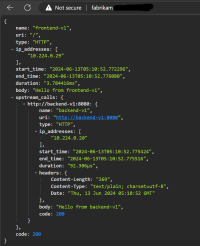
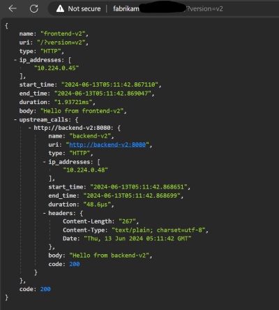
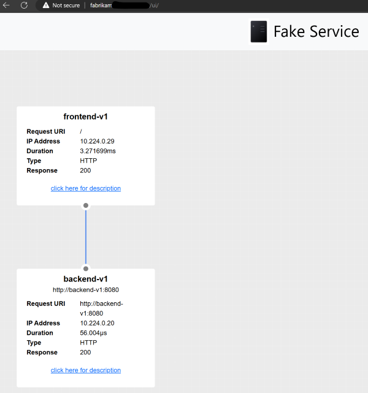
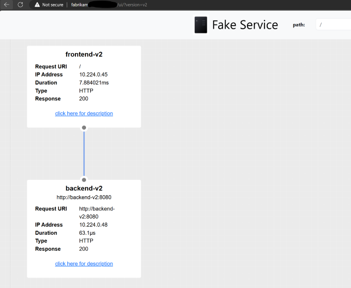

Application Gateway for Containers
==================================

A basic demo using App Gateway for Containers (AGC) with AKS and the ALB Controller.

A sample app using [Fake Service](https://github.com/nicholasjackson/fake-service) is used for a UI (SPA) that is accessed via the AGC Gateway API.  This app also serves as a REST API that is also accessed via the AGC Gateway API.

The app sample shows how to pass a query parameter or HTTP header to route to different backends (e.g. v1 or v2).  The sample also shows how to append headers to requests routed to backend services (e.g. `app-version: v2`).

## AKS and AGC setup

```sh
SUBSCRIPTION_ID='<your subscription id>'
AKS_NAME="appgw4c-aks"
RESOURCE_GROUP="appgw4c-aks"
LOCATION="australiaeast"
VM_SIZE="Standard_D4s_v3"
NODE_COUNT=2
IDENTITY_RESOURCE_NAME='azure-alb-identity'

az login
az account set --subscription $SUBSCRIPTION_ID

az provider register --namespace Microsoft.ContainerService
az provider register --namespace Microsoft.Network
az provider register --namespace Microsoft.NetworkFunction
az provider register --namespace Microsoft.ServiceNetworking

# Wait until "Registered"
az provider show --namespace Microsoft.ContainerService -o table
az provider show --namespace Microsoft.Network -o table
az provider show --namespace Microsoft.NetworkFunction -o table
az provider show --namespace Microsoft.ServiceNetworking -o table

az extension update --name alb || az extension add --name alb

az group create \
    --name $RESOURCE_GROUP \
    --location $LOCATION

# Create the AKS cluster
az aks create \
    --resource-group $RESOURCE_GROUP \
    --name $AKS_NAME \
    --location $LOCATION \
    --node-vm-size $VM_SIZE \
    --node-count $NODE_COUNT \
    --network-plugin azure \
    --enable-oidc-issuer \
    --enable-workload-identity \
    --generate-ssh-key

az aks get-credentials --resource-group $RESOURCE_GROUP --name $AKS_NAME

# Install kubectl and kubelogin
az aks install-cli

# Install helm
curl https://raw.githubusercontent.com/helm/helm/main/scripts/get-helm-3 | bash

# Install the ALB Controller
# See: https://learn.microsoft.com/en-us/azure/application-gateway/for-containers/quickstart-deploy-application-gateway-for-containers-alb-controller
mcResourceGroup=$(az aks show --resource-group $RESOURCE_GROUP --name $AKS_NAME --query "nodeResourceGroup" -o tsv)
mcResourceGroupId=$(az group show --name $mcResourceGroup --query id -otsv)

echo "Creating identity $IDENTITY_RESOURCE_NAME in resource group $RESOURCE_GROUP"
az identity create --resource-group $RESOURCE_GROUP --name $IDENTITY_RESOURCE_NAME
principalId="$(az identity show -g $RESOURCE_GROUP -n $IDENTITY_RESOURCE_NAME --query principalId -otsv)"

echo "Waiting 60 seconds to allow for replication of the identity..."
sleep 60

echo "Apply Reader role to the AKS managed cluster resource group for the newly provisioned identity"
az role assignment create --assignee-object-id $principalId --assignee-principal-type ServicePrincipal --scope $mcResourceGroupId --role "acdd72a7-3385-48ef-bd42-f606fba81ae7" # Reader role

echo "Set up federation with AKS OIDC issuer"
AKS_OIDC_ISSUER="$(az aks show -n "$AKS_NAME" -g "$RESOURCE_GROUP" --query "oidcIssuerProfile.issuerUrl" -o tsv)"
az identity federated-credential create --name "azure-alb-identity" --identity-name "$IDENTITY_RESOURCE_NAME" --resource-group $RESOURCE_GROUP --issuer "$AKS_OIDC_ISSUER" --subject "system:serviceaccount:azure-alb-system:alb-controller-sa"

helm install alb-controller \
    oci://mcr.microsoft.com/application-lb/charts/alb-controller \
    --namespace default \
    --version 1.0.2 \
    --set albController.namespace=azure-alb-system \
    --set albController.podIdentity.clientID=$(az identity show -g $RESOURCE_GROUP -n azure-alb-identity --query clientId -o tsv)

# Verify the ALB Controller installation
kubectl get pods -n azure-alb-system
kubectl get gatewayclass azure-alb-external -o yaml

# Managed AGC deployment - Prepare your virtual network / subnet for Application Gateway for Containers
# See: https://learn.microsoft.com/en-us/azure/application-gateway/for-containers/quickstart-create-application-gateway-for-containers-managed-by-alb-controller?tabs=new-subnet-aks-vnet
CLUSTER_SUBNET_ID=$(az vmss list --resource-group $mcResourceGroup --query '[0].virtualMachineProfile.networkProfile.networkInterfaceConfigurations[0].ipConfigurations[0].subnet.id' -o tsv)
read -d '' VNET_NAME VNET_RESOURCE_GROUP VNET_ID <<< $(az network vnet show --ids $CLUSTER_SUBNET_ID --query '[name, resourceGroup, id]' -o tsv)

az network vnet show --ids $CLUSTER_SUBNET_ID --query subnets[0].addressPrefix -o tsv

# Choose a subnet address prefix from the output above that is not overlapping with the AKS cluster subnet and is at least /24
# Hint, use: https://www.davidc.net/sites/default/subnets/subnets.html
SUBNET_ADDRESS_PREFIX="10.225.0.0/24"
ALB_SUBNET_NAME='subnet-alb'

az network vnet subnet create --resource-group $VNET_RESOURCE_GROUP --vnet-name $VNET_NAME --name $ALB_SUBNET_NAME --address-prefixes $SUBNET_ADDRESS_PREFIX --delegations 'Microsoft.ServiceNetworking/trafficControllers'

ALB_SUBNET_ID=$(az network vnet subnet show --name $ALB_SUBNET_NAME --resource-group $VNET_RESOURCE_GROUP --vnet-name $VNET_NAME --query '[id]' --output tsv)

# Delegate permissions to managed identity

# Delegate AppGw for Containers Configuration Manag role to AKS Managed Cluster RG
az role assignment create --assignee-object-id $principalId --assignee-principal-type ServicePrincipal --scope $mcResourceGroupId --role "fbc52c3f-28ad-4303-a892-8a056630b8f1"

# Delegate Network Contributor permission for join to association subnet
az role assignment create --assignee-object-id $principalId --assignee-principal-type ServicePrincipal --scope $ALB_SUBNET_ID --role "4d97b98b-1d4f-4787-a291-c67834d212e7"

# Create ApplicationLoadBalancer Kubernetes resource
# It can take 5-6 minutes for the Application Gateway for Containers resources to be created.
kubectl apply -f - <<EOF
apiVersion: v1
kind: Namespace
metadata:
  name: alb-test-infra
EOF

kubectl apply -f - <<EOF
apiVersion: alb.networking.azure.io/v1
kind: ApplicationLoadBalancer
metadata:
  name: alb-test
  namespace: alb-test-infra
spec:
  associations:
  - $ALB_SUBNET_ID
EOF

# Validate creation of the Application Gateway for Containers resources
kubectl get applicationloadbalancer alb-test -n alb-test-infra -o yaml -w
```

## Deploy and test a sample application

```sh
# Deploy multisite application
# See: https://learn.microsoft.com/en-us/azure/application-gateway/for-containers/how-to-multiple-site-hosting-gateway-api?tabs=alb-managed
kubectl apply -f deployment.yaml
kubectl apply -f gateway.yaml

kubectl get gateway gateway-01 -n test-infra -o yaml -w

fqdn=$(kubectl get gateway gateway-01 -n test-infra -o jsonpath='{.status.addresses[0].value}')

# Update your custom dns zone: contoso.<mydomain> with the $fdqn return above
# contoso CNAME TTL 60 xxxxxxxxxxxxx.yyyy.alb.azure.com
# fabrikam CNAME TTL 60 xxxxxxxxxxxxx.yyyy.alb.azure.com

# Update httproutes.yaml with your custom domains
kubectl apply -f httproutes.yaml

kubectl get httproute contoso-route -n test-infra -o yaml
kubectl get httproute fabrikam-route -n test-infra -o yaml

# Test the app

# This HTTP Route will round-robin between backend v1 and v2
# when http://contoso.<mydomain> is accessed
for i in `seq 1 10`; do curl -s http://contoso.YOUR.DOMAIN | jq .body; done

"Hello from backend-v2"
"Hello from backend-v1"
"Hello from backend-v1"
"Hello from backend-v2"
"Hello from backend-v2"
"Hello from backend-v1"
"Hello from backend-v2"
"Hello from backend-v2"
"Hello from backend-v1"
"Hello from backend-v1"

# This HTTP Route will route all requests with"
# - a query parameter app-version=v2   (*from the SPA UI to service)
# - a HTTP header app-version: v2       (*from an API call service)
# to backend v2
# otherwise, it will route to backend v1
# when http://fabrikam.<mydomain> is accessed
# (*) Since the same service hosts the SPA UI and REST API,. we need to handle both
# scenarios to route to the v2 backend.

for i in `seq 1 10`; do curl -s http://fabrikam.YOUR.DOMAIN | jq .body; done

"Hello from backend-v1"
"Hello from backend-v1"
"Hello from backend-v1"
"Hello from backend-v1"
"Hello from backend-v1"
"Hello from backend-v1"
"Hello from backend-v1"
"Hello from backend-v1"
"Hello from backend-v1"
"Hello from backend-v1"

for i in `seq 1 10`; do curl -s -H "app-version: v2" http://fabrikam.YOUR.DOMAIN | jq .body; done

"Hello from backend-v2"
"Hello from backend-v2"
"Hello from backend-v2"
"Hello from backend-v2"
"Hello from backend-v2"
"Hello from backend-v2"
"Hello from backend-v2"
"Hello from backend-v2"
"Hello from backend-v2"
"Hello from backend-v2"

for i in `seq 1 10`; do curl -s http://fabrikam.YOUR.DOMAIN?version=v2 | jq .body; done

"Hello from backend-v2"
"Hello from backend-v2"
"Hello from backend-v2"
"Hello from backend-v2"
"Hello from backend-v2"
"Hello from backend-v2"
"Hello from backend-v2"
"Hello from backend-v2"
"Hello from backend-v2"
"Hello from backend-v2"

for i in `seq 1 10`; do curl -s -H "Referer: http://fabrikam.YOUR.DOMAIN/ui/?version=v2" http://fabrikam.YOUR.DOMAIN | jq .body; done

"Hello from frontend-v2"
"Hello from frontend-v2"
"Hello from frontend-v2"
"Hello from frontend-v2"
"Hello from frontend-v2"
"Hello from frontend-v2"
"Hello from frontend-v2"
"Hello from frontend-v2"
"Hello from frontend-v2"
"Hello from frontend-v2"
```

From the browser:

[http://fabrikam.YOUR.DOMAIN/](http://fabrikam.YOUR.DOMAIN/)

```json
{
  "name": "frontend-v1",
  "uri": "/",
  "type": "HTTP",
  ...
  "body": "Hello from frontend-v1",
  "upstream_calls": {
    "http://backend-v1:8080": {
      "name": "backend-v1",
      "uri": "http://backend-v1:8080",
      "type": "HTTP",
      ...
      "body": "Hello from backend-v1",
      "code": 200
    }
  },
  "code": 200
}
```




[http://fabrikam.YOUR.DOMAIN/?version=v2](http://fabrikam.YOUR.DOMAIN/?version=v2)

```json
{
  "name": "frontend-v2",
  "uri": "/?version=v2",
  "type": "HTTP",
  ...
  "body": "Hello from frontend-v2",
  "upstream_calls": {
    "http://backend-v1:8080": {
      "name": "backend-v2",
      "uri": "http://backend-v1:8080",
      "type": "HTTP",
      ...
      "body": "Hello from backend-v2",
      "code": 200
    }
  },
  "code": 200
}
```



[http://fabrikam.YOUR.DOMAIN/ui/](http://fabrikam.YOUR.DOMAIN/ui/)

* UI shows frontend-v1 -> backend-v1



[http://fabrikam.YOUR.DOMAIN/ui/?version=v2](http://fabrikam.YOUR.DOMAIN/ui/?version=v2)

* UI shows frontend-v2 -> backend-v2



* `frontend-v2` pod logs show:

```sh
# Tail logs for frontend-v2 pod
kubectl logs -f frontend-v2-d56c9464f-xvcqb -n test-infra
```

Reload the browser page and view the logs in the terminal:

```sh
2024-06-13T04:10:48.506Z [INFO]  Handle inbound request:
  request=
  | GET / HTTP/1.1
  | Host: fabrikam.YOUR.DOMAIN
...
  | app-version: v2
...
  | referer: http://fabrikam.YOUR.DOMAIN/ui/?version=v2
...
```

We can see that the HTTP header `app-version: v2` was added to the request.

## Cleanup

```sh
helm uninstall alb-controller
kubectl delete ns azure-alb-system
kubectl delete gatewayclass azure-alb-external

# Optional: delete all Azure resources for the demo
az group delete --resource-group $RESOURCE_GROUP
```

## Resources

* [Quickstart: Deploy Application Gateway for Containers ALB Controller](https://learn.microsoft.com/en-us/azure/application-gateway/for-containers/quickstart-deploy-application-gateway-for-containers-alb-controller)
* [Quickstart: Create Application Gateway for Containers managed by ALB Controller](https://learn.microsoft.com/en-us/azure/application-gateway/for-containers/quickstart-create-application-gateway-for-containers-managed-by-alb-controller?tabs=new-subnet-aks-vnet)
* [Multi-site hosting with Application Gateway for Containers - Gateway API](https://learn.microsoft.com/en-us/azure/application-gateway/for-containers/how-to-multiple-site-hosting-gateway-api?tabs=alb-managed)
* [Kubernetes Gateway API](https://gateway-api.sigs.k8s.io/)